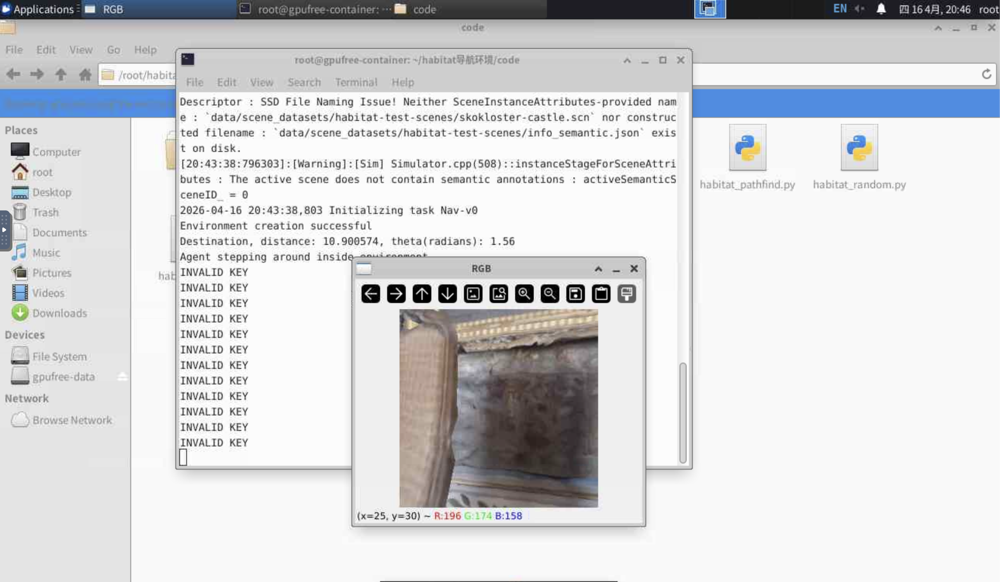
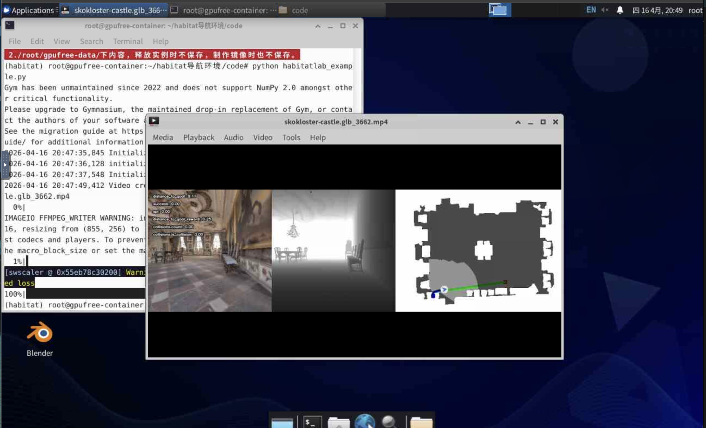

# Task01：我从传感器、AGV 和扫地机器人开始理解具身智能

## 1. 我一开始的理解和疑问

这篇是我作为零基础学习者的 Task01 记录，不是完整技术综述。刚打开课程目录的时候，我其实有点懵：机器人发展史、PID、CartPole、Habitat、春晚机器人这些内容都放在一起，我一开始不太确定到底学到哪里才算完成 Task01。

后来梳理下来，我觉得今天先抓住一条线就够了：

> 机器人不是只有一个“大脑”，它还必须有身体、传感器、执行器，并且能在环境中不断获得反馈。

我在学习过程中也产生了一些很自然的疑问。比如看到强化学习的奖励机制时，我会想：机器人会不会因为奖励而像人一样产生积极反射？看到激光雷达和视觉传感器时，我又想起去年在广州广交会智能制造展上看到的大量传感器；看到移动机器人和导航时，也会联想到学校组织去佛山嘉腾参观 AGV 的经历。

所以这篇笔记不追求把所有概念讲全，而是先回答几个我自己最想搞明白的问题：

- 具身智能和普通 AI 有什么区别？
- 机器人为什么需要“感知-决策-控制”闭环？
- 传感器、AGV、扫地机器人这些现实案例，和具身智能有什么关系？
- PID 控制到底在控制什么？
- 强化学习里的奖励机制，会不会让机器人像人一样“积极”？

## 2. 我对具身智能的理解

具身智能不是只会在屏幕里回答问题的 AI，而是能通过“身体”进入真实或仿真环境，感知环境、做出决策、执行动作，并根据反馈继续学习的智能系统。

我现在可以先把它理解成：

> 具身智能 = 智能大脑 + 机器人身体 + 环境反馈。

普通 AI 更多是在数字世界里处理文字、图片、音频等信息；具身智能则要进入真实或仿真环境，通过身体和环境发生交互。它不只是“想明白”，还要“做出来”，并且要根据做出来之后的反馈继续调整。

## 3. 感知、决策、控制、本体的关系

- 感知：负责把环境信息输入给系统，例如图像、距离、声音、触觉。
- 决策：负责判断下一步做什么，例如向前走、抓杯子、避开障碍物。
- 控制：负责把决策变成具体动作，例如电机转多少、机械臂移动到哪里。
- 本体：负责承载智能的身体，例如移动机器人、机械臂、人形机器人。

它们之间的关系可以理解为：

> 本体在环境中行动，传感器产生感知；大脑根据感知做决策；控制器把决策变成动作；动作改变环境或自身状态，然后产生新的反馈。

这条链路可以简化成：

```text
环境 -> 感知 -> 决策 -> 控制 -> 动作 -> 环境反馈
```

这也是我理解 Task01 的核心框架。后面无论是视觉、导航、强化学习、机械臂还是 VLA，本质上都可以放回这个闭环里看。

## 4. 从广交会智能制造展想到的：具身智能不是只有“大脑”

课程里讲到激光雷达、视觉传感器等感知模块时，我想起去年在广州参加广交会智能制造展的经历。当时我原本以为展会上会有很多高度集成的智能机器人，但实际看到的更多是传感器、激光雷达、工业相机、控制部件等模块化产品。

现在回头看，这件事很能说明具身智能的一个底层逻辑：机器人要进入物理世界，第一步不是“变聪明”，而是先要可靠地感知世界。没有传感器，机器人就不知道环境在哪里、障碍物在哪里、目标物在哪里，也无法形成后续的决策和控制。

这个点我之前其实没太意识到。我原来会下意识觉得具身智能是不是就是“大模型 + 机器人”，但看完传感器和 AGV 这些例子后，感觉它没有这么简单。大模型可以承担一部分“大脑”功能，但机器人真正落地，还需要传感器、本体结构、控制系统、执行器和场景适配。

## 5. 从佛山嘉腾 AGV 参观看具身智能的落地

去年我也跟学校组织去佛山嘉腾参观过 AGV 相关企业。结合这次 Task01 的学习，我重新理解了 AGV：它不是单纯的一辆自动小车，而是一个由机器人本体、传感器、控制系统、路径规划和调度系统组成的具身智能系统。

AGV 在工厂或仓储环境中运行时，需要先感知自身位置和周围环境，再根据任务进行路径规划，最后由控制系统把路线转化成电机速度、转向和避障动作。这个过程其实就是“感知-决策-控制”闭环在工业物流场景里的具体体现。

这也让我意识到，具身智能并不一定首先表现为人形机器人。很多更早落地的具身智能系统，可能出现在 AGV、机械臂、智能仓储和工业制造里，因为这些场景任务更明确、环境更可控，也更容易商业化。

## 6. 扫地机器人让我理解：路径规划不一定越复杂越好

我以前看过一篇关于扫地机器人路径选择的文章，里面提到一个很反直觉的结论：在大量案例中，某些情况下“乱走”反而是很有效的路径策略。这个点我觉得挺有意思，因为直觉上会觉得机器人越聪明越应该规划路径，但扫地机器人这个例子反而说明，工程里经常要看场景和成本。

早期扫地机器人的随机游走策略，看起来不聪明，但它对传感器和建图能力要求低，成本低，在封闭家庭空间里只要运行时间足够长，也能覆盖大部分区域。它体现的是一种工程上的取舍：在简单场景里，用低成本方案达到可接受效果。

但这并不意味着随机路径永远最好。对于更复杂的房间、更高的清扫效率、更稳定的覆盖率，激光雷达或视觉 SLAM 建图后的规划路线会更有优势。也就是说，路径选择没有绝对最优，关键要看场景、成本、传感器能力和任务目标。

从具身智能角度看，扫地机器人也是一个感知-决策-控制闭环：它通过碰撞传感器、红外、激光雷达或视觉感知环境，根据路径策略决定下一步怎么走，再通过电机控制执行移动。不同路径策略背后，其实是不同硬件能力和成本结构下的决策选择。

## 7. 坐标系和坐标变换

机器人要行动，必须知道“东西在哪里”和“自己在哪里”。

但是同一个物体，在不同视角下坐标可能不同。例如杯子相对桌子的位置、相对摄像头的位置、相对机械臂的位置，都不是同一套坐标。

坐标变换就是把一个坐标系里的位置，转换到另一个坐标系里。齐次变换矩阵把旋转和平移合在一起，让机器人可以统一计算位置变化。

我目前不需要马上推公式，先记住它解决的问题：

> 坐标变换让机器人能把“我看见的位置”变成“我能伸手去抓的位置”。

比如摄像头看到杯子在某个位置，但机械臂要抓杯子，需要知道杯子相对机械臂在哪里。这个时候就需要把摄像头坐标系里的位置，转换到机械臂坐标系里。这样理解之后，旋转、平移、齐次变换矩阵就不只是公式，而是机器人把“看见”转成“能动手”的桥梁。

## 8. PID 控制

PID 控制是一种让系统接近目标的基础控制方法。

它的核心是误差：

> 误差 = 目标值 - 当前值。

P、I、D 三项可以这样理解：

- P：看到差距就立刻用力纠正。
- I：如果长期差一点到不了目标，就慢慢累积补偿。
- D：如果变化太快，就提前抑制，防止冲过头。

在机器人里，PID 可以用于速度控制、位置控制、角度控制、温度控制等场景。

PID 控制让我第一次比较直观地理解了“控制”这件事。控制不是机器人一次性做出完美动作，而是不断比较目标值和当前值之间的误差，再根据误差调整动作。

## 9. 我跑通的小实验

实验文件：

`demos/task01_pid_demo.py`

运行命令：

```bash
python3 demos/task01_pid_demo.py
```

这个 demo 模拟一个系统从当前值逐步接近目标值。它不依赖额外安装包，适合零基础先理解“控制器如何根据误差不断修正动作”。

运行后会生成：

`outputs/task01_pid_demo_result.csv`

已运行结果摘要：

- 第 1 步：当前值 5.76，误差 94.24。
- 第 20 步：当前值 33.17，误差 66.83。
- 第 40 步：当前值 56.16，误差 43.84。
- 第 80 步：当前值 87.50，误差 12.50。

我的理解：这个 demo 不是接真实机器人，也不是复杂仿真器，而是用 Python 写了一个简化系统。控制器不是一次性把系统推到目标，而是每一步都看“目标值和当前值差多少”，再根据误差调整控制量。随着当前值越来越接近目标，误差逐渐变小，控制量也会变小。

## 10. 跟着小红书教学视频跑 Habitat 云端导航 demo

除了本地的 PID 小实验，我还根据飞书 Task01“具身导航基础（优先完成作业）”下面提供的视频教程，在 gpufree.cn 云环境中尝试运行了课程提供的 Habitat 导航 demo。这个环境使用的是 `datawhale-habitat导航环境` 镜像，不是在我本机安装复杂依赖，而是在云端预置环境里运行。

我跟着视频进入云端环境后，运行了类似下面的命令：

```bash
python habitatlab_example.py
```

运行过程中，终端显示环境初始化成功，并生成了类似 `skokloster-castle.glb_3662.mp4` 的视频文件。画面里可以看到 RGB 视角、深度信息和地图轨迹，这让我第一次比较直观地看到：具身导航不一定一开始就要在真实机器人上完成，也可以先在虚拟环境中让 agent 观察场景、执行动作、记录路线。

运行截图：



视频结果截图：



我目前还没有深入理解 Habitat 的内部机制，但先知道了它在具身智能里的作用：提供一个可控的虚拟环境，让 agent 在里面完成导航任务。这和前面理解的“感知-决策-控制-反馈”闭环是对应的。

这个实践对我来说更像是先跑通一个入口：知道云环境、仿真场景、agent 行动、RGB/深度/地图输出之间大概是什么关系。后面如果继续学具身导航，再回来补 Habitat Lab、Habitat Sim 和具体导航算法。

## 11. 强化学习里的奖励机制，会让机器人“开心”吗？

看到强化学习里的“奖励机制”时，我第一反应是：机器人会不会因为奖励而像人一样产生积极反射？

后来我理解到，强化学习里的奖励不是情绪，也不是开心或痛苦，而是一个数学分数。它的作用是告诉算法：刚才这个动作是否有利于完成目标。比如机器人走得更稳、离目标更近，就给更高奖励；摔倒、撞到障碍物，就给负奖励。

所以我现在先把奖励机制理解成“打分”，不是“开心”。机器人不会真的因为奖励高就兴奋，它只是通过这个分数调整以后更可能采取什么动作。从外部看，这有点像人类受到正反馈后更愿意继续做某件事；但本质上，它只是策略被奖励函数优化后的行为倾向。

这也让我更理解具身智能里的学习闭环：

```text
观察环境 -> 选择动作 -> 环境变化 -> 获得奖励或惩罚 -> 更新策略
```

奖励机制的价值，不是让机器人产生情绪，而是把“目标是否完成得好”变成算法可以优化的信号。

## 12. 本次学习的问题

- 我还没有完全理解运动学和强化学习的数学细节。
- 坐标变换里的矩阵公式目前只理解用途，还没有完全掌握推导。
- PID 参数如何调优，还需要后面结合更多例子理解。
- 扫地机器人的随机路径在什么边界条件下最有效，可以后续再查资料确认。
- Habitat 云端 demo 已经跑通，但还没有深入理解 Habitat Lab 和 Habitat Sim 的区别。

## 13. 本次 Task01 小结

Task01 对我来说最大的收获，不是记住了多少机器人术语，而是先建立了一个基础框架：具身智能机器人需要通过身体进入环境，通过传感器感知，通过算法决策，通过控制系统执行动作，再通过反馈不断修正。

结合广交会智能制造展上看到的大量传感器、佛山嘉腾 AGV 参观经历、扫地机器人路径选择的例子，以及这次跟着视频跑通的 Habitat 云端导航 demo，我更能理解具身智能为什么不是单纯的大模型问题。它真正落地时，需要感知、决策、控制、本体、环境和工具链一起配合。后面的视觉、导航、强化学习、VLA 等方向，本质上都可以放回这个闭环里继续理解。

## 14. 资料来源

- Datawhale Every-Embodied 开源教程：https://github.com/datawhalechina/every-embodied
- 具身智能概述：https://github.com/datawhalechina/every-embodied/blob/main/01-具身智能概述/01具身智能概述.md
- 机器人空间描述与坐标变换：https://github.com/datawhalechina/every-embodied/blob/main/02-机器人基础和控制、手眼协调/01机器人空间描述与坐标变换.md
- PID 控制基础：https://github.com/datawhalechina/every-embodied/blob/main/02-机器人基础和控制、手眼协调/补充02PID_Control.md
- Task01 具身导航基础视频教程：http://xhslink.com/o/4FGHWn2YICu
